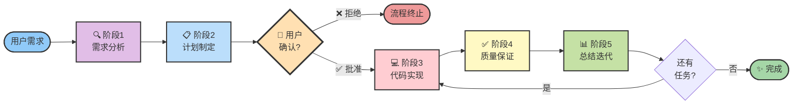
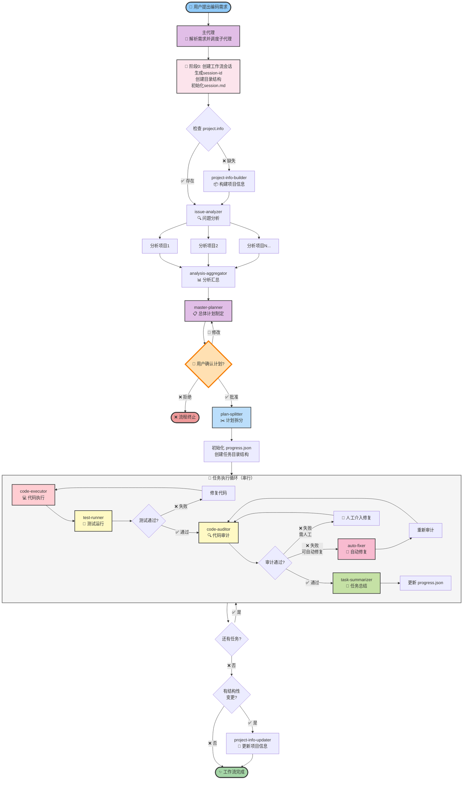

# .claude 目录说明

> Claude Code 多代理协同开发框架
>
> 版本：1.0.0
> 创建时间：2025-12-31

## 目录概览

```
.claude/
├── agents/                      # 子代理定义目录
│   ├── project-info-builder.md  # 项目信息构建代理
│   ├── project-info-updater.md  # 项目信息更新代理
│   ├── issue-analyzer.md        # 问题分析代理
│   ├── analysis-aggregator.md   # 分析汇总代理
│   ├── master-planner.md        # 总体计划制定代理
│   ├── plan-splitter.md         # 计划拆分代理
│   ├── code-executor.md         # 代码执行代理
│   ├── test-runner.md           # 测试运行代理
│   ├── code-auditor.md          # 代码审计代理
│   ├── auto-fixer.md            # 自动修复代理
│   └── task-summarizer.md       # 任务总结代理
├── sessions/                    # 工作流会话目录（运行时生成）
│   ├── .template/               # 会话模板
│   └── {序号}-{描述}-{时间}/     # 具体会话目录
│       ├── analysis/            # 分析阶段产物
│       ├── planning/            # 计划阶段产物
│       ├── execution/           # 执行阶段产物
│       └── workflow/            # 工作流元数据
├── workflow/                    # 工作流模板目录
│   ├── workflow-session.md.template  # 工作流会话记录模板
│   └── progress.json.template        # 进度跟踪JSON模板
└── README.md                    # 本文件

```

## 核心概念

### 多代理协同架构

本框架采用**多代理协同**的设计理念，将复杂的软件开发流程拆分为多个专职子代理，每个代理负责特定的职责：

- **主代理**：直接调度所有子代理，统筹全局工作流
- **分析层**：issue-analyzer、analysis-aggregator 深度分析项目
- **计划层**：master-planner、plan-splitter 制定和拆分实施计划
- **执行层**：code-executor、test-runner 实现代码和测试
- **质量层**：code-auditor、auto-fixer 保障代码质量
- **总结层**：task-summarizer、project-info-builder、project-info-updater 汇总任务成果和维护项目信息

### 工作流生命周期

1. **需求接收** → 用户提出编码需求
2. **项目准备** → 检查/生成项目信息
3. **深度分析** → 分析影响范围和风险
4. **计划制定** → 制定整体实施计划（需用户确认）
5. **任务拆分** → 拆分为可执行的子任务
6. **代码实现** → 按任务逐一实现
7. **测试验证** → 运行测试确保质量
8. **代码审计** → 审查代码质量和安全
9. **问题修复** → 自动或人工修复问题
10. **任务总结** → 总结成果，更新进度

## 整体调用流程

### 核心流程概览（简化版）

以下流程图展示了工作流的5大核心阶段，便于快速理解整体架构：



**5大阶段说明**：
1. **🔍 需求分析**：创建会话 → 检查项目信息 → 多项目并行分析 → 汇总结果
2. **📋 计划制定**：制定整体计划 → **用户确认**（必须） → 拆分任务 → 初始化进度
3. **💻 代码实现**：读取任务 → 实现代码 → 运行测试 → 生成报告
4. **✅ 质量保证**：代码审计 → 自动修复/人工介入 → 重新审计
5. **📊 总结迭代**：总结成果 → 更新进度 → 准备下一任务 → 更新项目信息

---

### 详细流程图（完整版）

以下流程图展示了所有子代理的调用关系和详细逻辑：



**关键节点说明**：
- **🎯 主代理**：直接调度所有子代理，负责整体编排
- **👤 用户确认**：master-planner 阶段必须等待用户批准
- **🔄 任务执行循环**：串行执行，每个任务都经过 实现→测试→审计→总结
- **🔧 失败恢复**：测试失败重新实现，审计失败自动修复或人工介入
- **✨ 结构性变更**：有变更时触发 project-info-updater

### 详细流程说明

#### 阶段1：需求分析阶段

```
用户需求
    ↓
主代理（解析需求，识别涉及项目，创建会话）
    ↓
project-info-builder（如 project.info 不存在）
    ↓
issue-analyzer（针对每个项目并行分析）
    ├── 定位关键模块
    ├── 评估影响范围
    └── 识别风险点
    ↓
analysis-aggregator（汇总分析结果）
    ├── 整合跨项目依赖
    ├── 汇总全局风险
    └── 生成分析摘要
```

**输出产物**：
- `.claude/sessions/{session-id}/workflow/session.md` - 工作流会话记录
- `.claude/sessions/{session-id}/analysis/{project}-analysis.md` - 各项目分析报告
- `.claude/sessions/{session-id}/analysis/summary.md` - 汇总分析报告

---

#### 阶段2：计划制定阶段

```
分析汇总结果
    ↓
master-planner（制定整体计划）
    ├── 划分实施阶段
    ├── 分解阶段任务
    ├── 识别风险和假设
    └── 列出人工确认项
    ↓
用户确认（必须）
    ├── 审阅计划
    ├── 做出决策
    └── 批准/修改/拒绝
    ↓
plan-splitter（批准后拆分）
    ├── 创建目录结构
    ├── 生成任务文档
    ├── 创建阶段索引
    └── 初始化进度跟踪
```

**输出产物**：
- `.claude/sessions/{session-id}/planning/overall-plan.md` - 整体实施计划
- `.claude/sessions/{session-id}/planning/phases.md` - 阶段和任务索引
- `.claude/.claude/sessions/{session-id}/execution/phaseXX-*/taskYY-*/task.md` - 详细任务文档
- `.claude/sessions/{session-id}/workflow/progress.json` - 进度跟踪文件

---

#### 阶段3：代码实现阶段

```
任务队列（从 progress.json 获取）
    ↓
code-executor（执行任务）
    ├── 读取任务文档
    ├── 实现代码变更
    ├── 代码质量检查
    └── 生成任务报告
    ↓
test-runner（运行测试）
    ├── 单元测试
    ├── 集成测试
    └── E2E测试（如需要）
    ↓
测试结果判断
    ├── 通过 → 继续
    └── 失败 → 返回 code-executor 修复
```

**输出产物**：
- 实际代码变更（修改/新增/删除文件）
- `.claude/.claude/sessions/{session-id}/execution/{task-dir}/reports/task-report.md` - 任务执行报告
- `.claude/.claude/sessions/{session-id}/execution/{task-dir}/reports/test-result.md` - 测试结果报告

---

#### 阶段4：质量保证阶段

```
测试通过的代码
    ↓
code-auditor（代码审计）
    ├── 代码规范检查
    ├── 安全性审查
    ├── 性能分析
    └── 生成审计报告
    ↓
审计结果判断
    ├── 通过 → 继续
    ├── 失败（可自动修复） → auto-fixer
    └── 失败（需人工） → 通知用户
    ↓
auto-fixer（条件触发）
    ├── 自动修复可确定问题
    ├── 重新触发审计
    └── 记录修复过程
```

**输出产物**：
- `.claude/.claude/sessions/{session-id}/execution/{task-dir}/audit/audit-{timestamp}.md` - 审计报告
- 修复后的代码（如触发 auto-fixer）

---

#### 阶段5：总结和迭代

```
审计通过的任务
    ↓
task-summarizer（任务总结）
    ├── 汇总任务成果
    ├── 更新计划进度
    ├── 触发 project-info 更新（如有结构性变更）
    └── 准备下一任务
    ↓
检查任务队列
    ├── 还有任务 → 返回 code-executor
    └── 全部完成 → 工作流结束
    ↓
project-info-updater（如需要）
    └── 增量更新项目信息
```

**输出产物**：
- 更新的 `.claude/sessions/{session-id}/workflow/progress.json`
- 更新的 `.claude/sessions/{session-id}/planning/phases.md`
- 更新的 `{project}/project.info`（如有结构性变更）

---

## 子代理详解

### 1. project-info-builder（项目信息构建代理）

**职责**：
- 首次扫描项目生成结构化信息
- 提取目录、文件、函数签名及注释
- 生成 `project.info` 文件

**关键输出**：
- `{project}/project.info`

**工具**：Read, Glob, Grep, Bash, Write

---

### 2. issue-analyzer（问题分析代理）

**职责**：
- 针对单个项目深度分析需求
- 定位关键模块、文件和函数
- 评估潜在影响和风险

**关键输出**：
- `.claude/sessions/{session-id}/analysis/{project}-analysis.md`

**工具**：Read, Grep, Glob, Write, Task

---

### 3. analysis-aggregator（分析汇总代理）

**职责**：
- 汇总多个 issue-analyzer 的报告
- 整合跨项目依赖
- 产出统一的分析摘要

**关键输出**：
- `.claude/sessions/{session-id}/analysis/summary.md`

**工具**：Read, Write

---

### 4. master-planner（总体计划制定代理）

**职责**：
- 根据汇总分析创建整体实施计划
- 列出阶段、目标、风险点
- **需要用户确认后才能继续**

**关键输出**：
- `.claude/sessions/{session-id}/planning/overall-plan.md`
- `.claude/sessions/{session-id}/planning/changes.md`（如有变更）

**工具**：Read, Write

**关键流程**：
```
读取分析汇总 → 制定计划 → 等待用户确认 → 处理反馈 → 批准后继续
```

---

### 5. plan-splitter（计划拆分代理）

**职责**：
- 将整体计划拆分为可执行的子任务
- 生成标准化目录结构
- 创建详细任务文档

**关键输出**：
- `.claude/sessions/{session-id}/planning/phases.md`
- `.claude/.claude/sessions/{session-id}/execution/phaseXX-*/taskYY-*/task.md`
- `.claude/sessions/{session-id}/workflow/progress.json`

**目录结构**：
```
.claude/sessions/{session-id}/execution/
├── phase01-{阶段描述}/
│   ├── task01-{任务描述}/
│   │   ├── task.md
│   │   ├── audit/
│   │   └── reports/
│   └── README.md
└── README.md
```

---

### 6. code-executor（代码执行代理）

**职责**：
- 串行执行任务目录中的代码实现
- 维护进度状态
- 完成后调用测试和审计流程

**关键输出**：
- 实际代码变更
- `.claude/.claude/sessions/{session-id}/execution/{task-dir}/reports/task-report.md`

**工具**：Read, Write, Edit, Grep, Glob, Bash, Task

**工作流程**：
```
读取任务文档 → 实现代码 → 质量检查 → 调用测试 → 生成报告 → 更新进度
```

---

### 7. test-runner（测试运行代理）

**职责**：
- 针对单个任务运行限定范围的测试
- 生成详细的测试报告

**关键输出**：
- `.claude/.claude/sessions/{session-id}/execution/{task-dir}/reports/test-result.md`

**工具**：Bash, Read, Write

**测试类型**：
- 单元测试
- 集成测试
- E2E 测试（如需要）

---

### 8. code-auditor（代码审计代理）

**职责**：
- 对任务级代码进行质量审计
- 检查代码规范、安全性、性能等
- 输出问题列表及严重性评级

**关键输出**：
- `.claude/.claude/sessions/{session-id}/execution/{task-dir}/audit/audit-{timestamp}.md`

**工具**：Read, Grep, Bash, Write

**审计维度**：
- 代码规范
- 安全性
- 性能
- 可维护性

---

### 9. auto-fixer（自动修复代理）

**职责**：
- 依据审计报告自动修复可确定的代码问题
- 修复后重新触发审计
- 无法修复的问题记录并交由人工处理

**关键输出**：
- 修复后的代码
- 修复记录

**工具**：Read, Edit, Write, Bash, Task

**触发条件**：
- code-auditor 发现可自动修复的问题

---

### 10. task-summarizer（任务总结代理）

**职责**：
- 任务完成后进行总结
- 更新计划进度
- 触发 project-info 更新（如有结构性变更）
- 准备下一任务

**关键输出**：
- 更新的 `.claude/sessions/{session-id}/workflow/progress.json`
- 更新的 `.claude/sessions/{session-id}/planning/phases.md`

**工具**：Read, Write, Task

---

### 11. project-info-updater（项目信息更新代理）

**职责**：
- 在新增/删除文件或函数等结构性变更后
- 增量更新 `project.info` 文件

**关键输出**：
- 更新的 `{project}/project.info`

**工具**：Read, Write, Grep, Bash

---

## 文件产物说明

### 工作流文件

| 文件路径 | 用途 | 生成者 | 更新者 |
|---------|------|--------|--------|
| `.claude/sessions/{session-id}/workflow/session.md` | 工作流会话记录 | 主代理 | 各代理 |
| `.claude/sessions/{session-id}/workflow/progress.json` | 进度跟踪 | plan-splitter | code-executor, task-summarizer |

### 分析文件

| 文件路径 | 用途 | 生成者 |
|---------|------|--------|
| `.claude/sessions/{session-id}/analysis/{project}-analysis.md` | 单项目分析报告 | issue-analyzer |
| `.claude/sessions/{session-id}/analysis/summary.md` | 汇总分析报告 | analysis-aggregator |

### 计划文件

| 文件路径 | 用途 | 生成者 |
|---------|------|--------|
| `.claude/sessions/{session-id}/planning/overall-plan.md` | 整体实施计划 | master-planner |
| `.claude/sessions/{session-id}/planning/changes.md` | 计划变更记录 | master-planner |
| `.claude/sessions/{session-id}/planning/phases.md` | 阶段和任务索引 | plan-splitter |

### 任务文件

| 文件路径 | 用途 | 生成者 |
|---------|------|--------|
| `.claude/.claude/sessions/{session-id}/execution/phaseXX-*/taskYY-*/task.md` | 任务详细说明 | plan-splitter |
| `.claude/.claude/sessions/{session-id}/execution/phaseXX-*/taskYY-*/reports/task-report.md` | 任务执行报告 | code-executor |
| `.claude/.claude/sessions/{session-id}/execution/phaseXX-*/taskYY-*/reports/test-result.md` | 测试结果报告 | test-runner |
| `.claude/.claude/sessions/{session-id}/execution/phaseXX-*/taskYY-*/audit/audit-{timestamp}.md` | 审计报告 | code-auditor |

### 项目信息文件

| 文件路径 | 用途 | 生成者 | 更新者 |
|---------|------|--------|--------|
| `{project}/project.info` | 项目结构信息 | project-info-builder | project-info-updater |

---

## 使用示例

### 场景1：新功能开发

```
1. 用户：我需要给 beilv-agent 添加用户认证功能
   ↓
2. 主代理接收需求，创建会话，检查 project.info
   ↓
3. issue-analyzer 分析项目，定位认证模块
   ↓
4. master-planner 制定计划：
   - Phase 1: 数据库设计
   - Phase 2: 后端 API
   - Phase 3: 前端集成
   - Phase 4: 测试和文档
   ↓
5. 用户确认计划
   ↓
6. plan-splitter 拆分任务：4个阶段，12个任务
   ↓
7. code-executor 逐个执行任务
   ↓
8. test-runner 测试每个任务
   ↓
9. code-auditor 审计代码质量
   ↓
10. task-summarizer 总结并准备下一任务
   ↓
11. 全部完成，认证功能上线
```

---

### 场景2：Bug 修复

```
1. 用户：修复登录页面的验证码显示问题
   ↓
2. 主代理解析需求，创建会话
   ↓
3. issue-analyzer 定位问题代码
   ↓
4. master-planner 制定修复计划
   ↓
5. 用户确认
   ↓
6. plan-splitter 拆分为1个阶段，2个任务
   ↓
7. code-executor 修复代码
   ↓
8. test-runner 运行相关测试
   ↓
9. code-auditor 审计变更
   ↓
10. 完成修复
```

---

## 关键特性

### 1. 用户确认机制

在 `master-planner` 阶段，**必须等待用户确认**才能继续：
- 用户可以审阅整体计划
- 用户可以对人工确认项做出决策
- 用户可以要求修改计划
- 只有用户批准后才会进入拆分和执行阶段

### 2. 增量更新机制

`project-info-updater` 只在必要时更新项目信息：
- 新增文件或函数
- 删除文件或函数
- 重大结构性变更

避免每次都完整扫描项目，提高效率。

### 3. 质量保证机制

每个任务都必须经过：
- 代码实现（code-executor）
- 测试验证（test-runner）
- 代码审计（code-auditor）
- 问题修复（auto-fixer 或人工）

确保代码质量达标。

### 4. 进度跟踪机制

通过 `progress.json` 实时跟踪：
- 当前阶段
- 当前任务
- 任务状态（pending/in_progress/completed/failed）
- 测试状态
- 审计状态

### 5. 失败恢复机制

- 测试失败 → code-executor 修复 → 重新测试
- 审计失败（可自动修复） → auto-fixer → 重新审计
- 审计失败（需人工） → 通知用户 → 人工修复 → 重新审计

---

## 最佳实践

### 1. 编写清晰的需求

用户需求应该：
- 明确目标和验收标准
- 指明涉及的项目
- 说明技术约束和限制

### 2. 及时确认计划

在 master-planner 阶段：
- 仔细审阅整体计划
- 对不清楚的地方及时提问
- 对人工确认项做出明确决策

### 3. 关注质量报告

定期查看：
- 任务执行报告
- 测试结果报告
- 审计报告

### 4. 保持项目信息最新

在重大变更后：
- 触发 project-info-updater 更新
- 确保 project.info 反映最新结构

---

## 常见问题

### Q1: 如果 project.info 不存在怎么办？

A: 主代理会自动调用 project-info-builder 生成。

### Q2: 如果测试一直失败怎么办？

A: code-executor 会尝试修复 3 次，如仍失败会标记为 "failed" 并通知用户介入。

### Q3: 如何跳过审计？

A: 不建议跳过。审计是质量保证的关键环节。如确实需要，可手动修改 progress.json。

### Q4: 如何并行执行多个任务？

A: 目前设计为串行执行以保证质量。如需并行，需要修改 code-executor 的调度逻辑。

### Q5: 如何重新执行失败的任务？

A: 在 progress.json 中将任务状态改为 "pending"，重新调用 code-executor。

---

## 扩展和定制

### 添加新的子代理

1. 在 `agents/` 目录创建新的 `.md` 文件
2. 定义代理的 name, description, tools, model, color
3. 编写代理的职责和工作流程
4. 在 CLAUDE.md 中添加调用逻辑

### 修改工作流

编辑 `CLAUDE.md` 中的工作流阶段说明，调整子代理的调用顺序和条件。

### 自定义任务模板

编辑 `plan-splitter.md` 中的任务文档模板，添加或删除章节。

---

## 技术栈

- **Claude Code CLI**：主框架
- **Markdown**：文档格式
- **JSON**：进度跟踪
- **Mermaid**：流程图
- **Bash**：自动化脚本

---

## 版本历史

- **v2.0.0** (2026-01-09)
  - 移除 workflow-orchestrator，主代理直接调度
  - 11个子代理
  - 简化架构，提高效率

- **v1.0.0** (2025-12-31)
  - 初始版本
  - 12个子代理
  - 完整的工作流支持

---

## 贡献者

- GYQ

---

## 许可证

MIT License

---

## 联系方式

如有问题或建议，请联系项目维护者。
