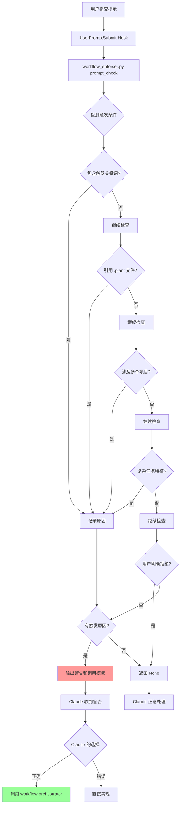

# Hooks 系统实施总结

## 已创建的文件

```
.claude/
├── settings.json                          # ✅ Hook 配置文件
└── hooks/
    ├── workflow_enforcer.py               # ✅ 核心强制执行器
    ├── README.md                          # ✅ 系统架构说明
    └── USAGE.md                           # ✅ 使用指南
```

## 系统功能

### 1. SessionStart Hook
- **触发时机**：每次会话开始或恢复时
- **功能**：注入核心工作流约束提醒
- **效果**：确保 Claude 在每次会话开始时都能看到工作流规则

### 2. UserPromptSubmit Hook
- **触发时机**：用户每次提交提示时
- **功能**：自动检测是否满足工作流触发条件
- **检测条件**：
  - ✅ 关键词触发（实现/开发/构建/添加/新增/重构/优化 XXX系统/功能/模块）
  - ✅ 引用计划文件（`.plan/` 目录）
  - ✅ 多项目需求（涉及 2 个或以上子项目）
  - ✅ 复杂任务特征（数据库设计、跨服务调用、多阶段实施、质量保证）
- **效果**：如果检测到触发条件，立即注入警告和调用模板

### 3. PreToolUse Hook
- **触发时机**：在 Claude 调用工具之前
- **功能**：检测是否绕过工作流直接修改业务代码
- **效果**：对不符合规范的操作发出警告（当前为观察模式，未阻止）

### 4. Stop Hook
- **触发时机**：Claude 完成一轮响应后
- **功能**：检查是否应该启动工作流但没有启动
- **效果**：提供后续提醒

## 已验证的测试用例

### ✅ 测试 1: SessionStart Hook
```bash
python3 .claude/hooks/workflow_enforcer.py session_start
```
**结果**：✅ 正常输出核心约束提醒

### ✅ 测试 2: 检测应触发工作流的场景
```bash
echo '{"user_prompt":"实现积分扣减系统，参考 .plan/106-积分扣减系统设计与实现/plan.md"}' | \
  python3 .claude/hooks/workflow_enforcer.py prompt_check
```
**结果**：✅ 正确检测到触发条件并输出警告

### ✅ 测试 3: 检测不应触发的场景
```bash
echo '{"user_prompt":"修改 project.py 第123行的变量名"}' | \
  python3 .claude/hooks/workflow_enforcer.py prompt_check
```
**结果**：✅ 无输出（正确行为）

### ✅ 测试 4: 检测用户拒绝工作流
```bash
echo '{"user_prompt":"实现用户认证功能，但是不要启动工作流，直接实现"}' | \
  python3 .claude/hooks/workflow_enforcer.py prompt_check
```
**结果**：✅ 无输出（正确识别用户拒绝）

## 工作原理



## 关键设计决策

### 1. 为什么不使用退出码 2 强制阻止？

**原因**：
- Hook 不能完美判断所有场景
- 过度阻止可能导致 Claude 陷入循环
- 提醒比强制更灵活

**当前策略**：
- 使用退出码 0 + 明确的警告信息
- 让 Claude 看到警告后自行判断
- 通过持续提醒提高遵循率

### 2. 为什么同时使用 SessionStart 和 UserPromptSubmit？

**原因**：
- **SessionStart**：确保会话开始时 Claude 了解规则
- **UserPromptSubmit**：每次用户输入时动态检测，避免遗忘

**效果**：
- 双重保障，提高稳定性
- 即使对话上下文很长，每次用户输入都会触发检测

### 3. 为什么检测逻辑在 Python 而不是 Bash？

**原因**：
- 更复杂的正则匹配和逻辑判断
- 更好的可维护性和可扩展性
- 支持未来可能的机器学习检测

## 与参考项目的对比

| 特性 | 参考项目 (mall) | 本项目 ({project-2}) | 说明 |
|------|----------------|---------------------|------|
| Hook 管理 | claude-autonomous (第三方工具) | workflow_enforcer.py (内置) | 本项目使用 Python 脚本，无需额外工具 |
| SessionStart | 注入协议 | 注入核心约束 | ✅ 已实现 |
| UserPromptSubmit | 注入状态 | 检测触发条件 | ✅ 已实现，功能更强 |
| PreToolUse | 代码审核门 | 工具使用检查 | ✅ 已实现（观察模式）|
| PostToolUse | 进度同步、错误跟踪 | - | ⏳ 未来可扩展 |
| Stop | 循环驱动器 | 响应后检查 | ✅ 已实现 |

## 下一步操作

### 立即生效（推荐）

1. **重启 Claude Code 会话**
   - 退出当前会话
   - 重新启动 Claude Code
   - Hooks 将自动加载

2. **验证 Hooks 是否生效**
   - 会话开始时应看到工作流提醒
   - 输入触发条件的需求，应看到警告

### 可选：启用调试日志

如果需要调试，编辑 `.claude/hooks/workflow_enforcer.py`：

```python
import logging

logging.basicConfig(
    filename="/tmp/workflow_enforcer.log",
    level=logging.DEBUG,
    format="%(asctime)s - %(levelname)s - %(message)s"
)
logger = logging.getLogger(__name__)

# 在关键位置添加
logger.debug(f"用户输入: {user_prompt}")
logger.info(f"触发条件: {reasons}")
```

查看日志：
```bash
tail -f /tmp/workflow_enforcer.log
```

## 预期效果

### Before（使用 Hooks 前）

**场景**：用户输入"实现积分扣减系统"

**Claude 可能的行为**：
- ❌ 直接开始实现代码
- ❌ 跳过工作流步骤
- ❌ 忘记调用 workflow-orchestrator

**结果**：
- 没有遵循多代理工作流
- 质量保证流程被跳过

---

### After（使用 Hooks 后）

**场景**：用户输入"实现积分扣减系统"

**Hook 触发**：
```
🚨 **检测到工作流触发条件** 🚨

- 检测到开发类关键词: '实现.*系统'

**必须执行的操作**：
使用 Task 工具调用 `workflow-orchestrator` 子代理，不要直接实现！
```

**Claude 的行为**：
- ✅ 看到警告后，调用 workflow-orchestrator
- ✅ 遵循完整的多代理工作流
- ✅ 质量保证流程得到执行

**结果**：
- 严格遵循工作流规则
- 代码质量得到保障

## 局限性和注意事项

### 1. Hook 不能强制 Claude 的行为

**说明**：Hooks 只能提供提醒，不能强制 Claude 必须执行某个操作。

**应对策略**：
- 设计清晰、明确的警告信息
- 提供具体的调用模板
- 在 CLAUDE.md 中反复强调

### 2. 正则匹配可能有误报或漏报

**误报示例**：
- "优化代码格式" 可能被识别为"优化XXX"而触发

**漏报示例**：
- "构造用户系统" 可能不会被识别（因为用词不是"实现"）

**应对策略**：
- 持续优化正则模式
- 根据实际使用情况调整
- 添加更多的触发模式

### 3. 上下文压缩可能导致提醒丢失

**说明**：如果对话进行了压缩（compact），SessionStart 的提醒可能不在压缩后的上下文中。

**应对策略**：
- UserPromptSubmit hook 会在每次用户输入时重新检测
- 确保 CLAUDE.md 中的规则被保留在压缩后的上下文中

## 测试清单

在部署前，请确认以下测试通过：

- [x] SessionStart hook 正常输出
- [x] UserPromptSubmit 检测应触发场景
- [x] UserPromptSubmit 忽略不应触发场景
- [x] UserPromptSubmit 识别用户拒绝工作流
- [ ] PreToolUse hook 正常执行（观察模式）
- [ ] Stop hook 正常执行
- [ ] 在实际 Claude Code 会话中验证

## 维护计划

### 定期检查（每月）

1. 检查是否有误报或漏报
2. 根据实际使用调整触发模式
3. 更新文档

### 版本更新

**当前版本**：1.0.0
**更新日期**：2026-01-05

**变更日志**：
- 2026-01-05：初始版本
  - 实现 4 个核心 hook 事件
  - 创建完整文档体系

---

## 总结

通过实施 Hooks 系统，我们实现了：

✅ **自动检测**：每次用户输入都会自动检测是否应触发工作流
✅ **持续提醒**：在多个关键点注入提醒，避免遗忘
✅ **明确指导**：提供具体的调用模板和示例
✅ **灵活控制**：支持用户明确拒绝工作流
✅ **可扩展性**：基于 Python，易于维护和扩展

**核心价值**：
将 CLAUDE.md 中的"软约束"转变为"硬提醒"，显著提高工作流遵循率，确保代码质量。

---

**文档维护者**：Claude + 用户
**反馈渠道**：通过 issue 或直接编辑文件
