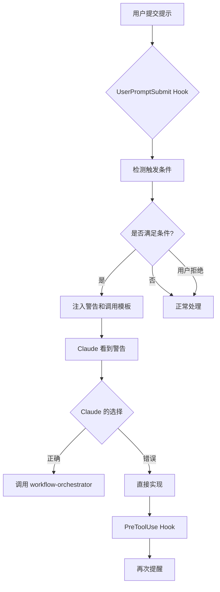

# 工作流 Hooks 系统说明

## 概述

本 hooks 系统旨在确保 Claude Code 严格遵循 `.claude/CLAUDE.md` 中定义的多代理工作流约束，即使在上下文增多后也不会遗忘或偏离。

## 系统架构

```
.claude/
├── settings.json              # Hook 配置文件
├── hooks/
│   ├── workflow_enforcer.py   # 核心强制执行器
│   └── README.md              # 本文件
└── CLAUDE.md                  # 工作流规则定义
```

## Hook 事件类型

### 1. SessionStart（会话开始）

**触发时机**：每次 Claude Code 会话开始或恢复时

**作用**：
- 在对话开始时注入核心工作流约束
- 提醒 Claude 检查每个用户请求是否应触发工作流

**实现**：
```bash
python3 .claude/hooks/workflow_enforcer.py session_start
```

**输出**：在对话开始时显示一个警告框，列出核心约束

---

### 2. UserPromptSubmit（用户提示提交）

**触发时机**：用户每次提交提示时（在 Claude 处理之前）

**作用**：
- 自动检测用户需求是否满足工作流触发条件
- 如果满足条件，立即注入警告和调用模板

**检测条件**：
1. **关键词触发**：
   - 开发类：实现/开发/构建/添加/新增/重构/优化 XXX系统/功能/模块
   - 计划类：执行计划/启动工作流/开始实施/按照XXX计划
   - 多代理类：使用多代理/启动工作流/完整流程

2. **引用计划文件**：用户输入包含 `.plan/`

3. **多项目需求**：涉及 2 个或以上子项目（{project-3}, {project-2}, {project-4}, {project-5}）

4. **复杂任务特征**：
   - 数据库设计/表结构
   - 接口调用/跨服务
   - 多阶段实施
   - 测试/审计/质量保证

**实现**：
```bash
python3 .claude/hooks/workflow_enforcer.py prompt_check < input.json
```

**输入格式**（通过 stdin）：
```json
{
  "user_prompt": "用户输入的完整内容"
}
```

**输出**：
- 如果检测到触发条件：输出警告信息和调用模板（退出码 0）
- 如果未检测到：无输出（退出码 0）
- 如果用户明确拒绝工作流：无输出（退出码 0）

---

### 3. PreToolUse（工具使用前）

**触发时机**：在 Claude 调用工具之前

**当前匹配器**：`Write|Edit`（写入或编辑文件）

**作用**：
- 检测是否绕过工作流直接修改业务代码
- 对不符合规范的操作发出警告

**实现**：
```bash
python3 .claude/hooks/workflow_enforcer.py tool_gate < input.json
```

**输入格式**（通过 stdin）：
```json
{
  "tool_name": "Write",
  "tool_input": {
    "file_path": "/path/to/file.py",
    "content": "..."
  }
}
```

---

### 4. Stop（响应完成）

**触发时机**：Claude 完成一轮响应后

**作用**：
- 检查是否应该启动工作流但没有启动
- 提供后续提醒

**实现**：
```bash
python3 .claude/hooks/workflow_enforcer.py response_check
```

---

## Hook 退出码说明

根据 Claude Code 官方文档：

- **退出码 0**：Hook 正常执行完成，输出会被显示给用户
- **退出码 1**：保留，通常用于脚本错误
- **退出码 2**：**阻止工具调用**（仅对 PreToolUse 有效），并将输出作为错误反馈给 Claude

## 工作流触发逻辑



## 不触发工作流的场景

以下场景**不应**触发工作流，hooks 会识别并忽略：

- ❌ 简单的代码修改（单文件、单函数）
- ❌ 文档更新或问答
- ❌ 配置文件调整
- ❌ Bug修复（明确的单点问题）
- ❌ 用户明确要求"不要启动工作流"或"直接实现"

## 示例场景

### 场景 1：应触发工作流

**用户输入**：
```
实现积分扣减系统，参考 .plan/106-积分扣减系统设计与实现/plan.md
```

**Hook 检测结果**：
```
🚨 检测到工作流触发条件 🚨

- 检测到开发类关键词: '实现.*系统'
- 引用了 .plan/ 目录中的文件

必须执行的操作：
使用 Task 工具调用 `workflow-orchestrator` 子代理，不要直接实现！
```

**Claude 应该做的**：
```python
Task(
    subagent_type="workflow-orchestrator",
    description="启动积分扣减系统工作流",
    prompt="""
请启动完整的多代理工作流，实现以下需求：

## 用户需求
实现积分扣减系统，参考 .plan/106-积分扣减系统设计与实现/plan.md

## 涉及项目
1. beilv-agent
2. beilv-agent-web

注：此处填写项目名称（来自 .claude/PROJECT.md 的 name 字段），不要填写完整路径。
"""
)
```

---

### 场景 2：不应触发工作流

**用户输入**：
```
修改 project.py 第123行的变量名
```

**Hook 检测结果**：
- 无输出（未满足触发条件）

**Claude 应该做的**：
- 直接修改变量名

---

### 场景 3：用户明确拒绝工作流

**用户输入**：
```
直接实现积分扣减功能，不需要完整流程
```

**Hook 检测结果**：
- 无输出（检测到用户明确拒绝）

**Claude 应该做的**：
- 按照用户要求直接实现

---

## 调试和维护

### 启用调试模式

编辑 `workflow_enforcer.py`，在主函数中添加日志：

```python
import logging
logging.basicConfig(
    filename="/tmp/workflow_enforcer.log",
    level=logging.DEBUG,
    format="%(asctime)s - %(levelname)s - %(message)s"
)
```

### 查看 Hook 执行日志

```bash
tail -f /tmp/workflow_enforcer.log
```

### 测试 Hook 脚本

```bash
# 测试 session_start
python3 .claude/hooks/workflow_enforcer.py session_start

# 测试 prompt_check
echo '{"user_prompt":"实现用户认证系统"}' | python3 .claude/hooks/workflow_enforcer.py prompt_check

# 测试 tool_gate
echo '{"tool_name":"Write","tool_input":{"file_path":"test.py"}}' | python3 .claude/hooks/workflow_enforcer.py tool_gate
```

### 自定义触发规则

编辑 `workflow_enforcer.py` 中的以下常量：

- `TRIGGER_PATTERNS`：关键词模式
- `PROJECT_KEYWORDS`：项目关键词
- `COMPLEXITY_PATTERNS`：复杂任务特征模式

---

## 局限性和注意事项

### 1. Hook 不能强制 Claude 的行为

Hooks 只能提供**提醒和反馈**，不能强制 Claude 必须调用 workflow-orchestrator。Claude 仍然可以选择忽略警告。

**解决方案**：
- 设计清晰、明确的警告信息
- 提供具体的调用模板
- 在 CLAUDE.md 中反复强调必须遵循

### 2. PreToolUse 的阻止功能（退出码 2）应谨慎使用

如果过度使用退出码 2 阻止工具调用，可能会导致 Claude 陷入循环或无法完成任务。

**当前实现**：
- 目前 `tool_gate` 只发出警告，不阻止操作
- 如需启用阻止功能，需要非常精确的逻辑判断

### 3. Hook 超时设置

当前所有 hooks 的超时设置为 5 秒。如果脚本执行时间超过 5 秒，会被强制终止。

**建议**：
- 保持 hook 脚本简单快速
- 避免在 hook 中进行复杂计算或网络请求

### 4. 上下文压缩后 Hook 提醒可能丢失

如果对话进行了压缩（compact），SessionStart 的提醒可能不在压缩后的上下文中。

**解决方案**：
- UserPromptSubmit hook 会在每次用户输入时重新检测
- 在 CLAUDE.md 中明确写入规则，确保压缩后保留

---

## 与参考项目的对比

| 特性 | 参考项目 (mall) | 本项目 ({project-2}) |
|------|----------------|---------------------|
| Hook 管理工具 | claude-autonomous | workflow_enforcer.py |
| SessionStart | 注入协议 | 注入核心约束 |
| UserPromptSubmit | 注入状态 | 检测触发条件 |
| PreToolUse | 代码审核门 | 工具使用检查 |
| PostToolUse | 进度同步、错误跟踪 | 暂未实现 |
| Stop | 循环驱动器 | 响应后检查 |

---

## 未来改进方向

1. **PostToolUse 进度同步**：
   - 在代码修改后自动更新进度文件
   - 记录修改历史

2. **会话状态跟踪**：
   - 检测当前是否在工作流会话中
   - 如果不在，阻止直接修改业务代码

3. **更智能的检测**：
   - 使用 NLP 模型分析用户意图
   - 动态学习项目特定的触发模式

4. **与工作流系统集成**：
   - 读取 `.claude/sessions/` 中的会话信息
   - 自动识别当前任务状态

---

## 5. create-branch-from-session.sh (会话分支自动化)

### 触发时机

- **PostToolUse(Write)**：监听 `session.md` 文件写入
- **PostToolUse(Bash)**：监听会话目录创建命令

### 作用

在创建工作流会话后,自动为涉及的项目从主分支创建新分支,确保所有后续操作都在独立分支上进行。

### 配置文件: PROJECT.md

**位置**: `/mnt/d/software/beilv-agent/.claude/PROJECT.md` ✨ 已调整

**格式**: YAML

**说明**:
- 配置文件位于 `.claude/` 目录，与框架配置统一
- 提供 `PROJECT.example.md` 作为模板，方便迁移到其他项目
- 建议将 `PROJECT.md` 加入 .gitignore（如果每个开发者路径不同）

**快速开始**:
```bash
# 1. 复制模板
cp .claude/PROJECT.example.md .claude/PROJECT.md

# 2. 编辑配置
# 修改 projects 列表中的项目路径、名称、主分支

# 3. 验证格式
python3 -c "import yaml; yaml.safe_load(open('.claude/PROJECT.md'))"
```

### 分支命名规则

默认格式: `session/{会话ID}`

**示例**:
- 会话ID: `001-前端Logo更新-20260109-1017`
- 分支名: `session/001-前端Logo更新-20260109-1017`

### 依赖

- Python 3.x
- PyYAML: `pip install pyyaml`

### 注意事项

1. **权限问题**: WSL 环境下可能遇到文件权限问题
2. **远程仓库**: 脚本默认不推送到远程
3. **分支清理**: 脚本只负责创建分支,不自动删除
4. **多项目并发**: 涉及大量项目时可能需要增加超时时间(当前60秒)

---

## 总结

通过 hooks 系统，我们将 CLAUDE.md 中的"软约束"转变为"硬提醒"，确保 Claude Code 在处理复杂任务时始终遵循多代理工作流。虽然不能完全强制 Claude 的行为，但通过持续的、明确的提醒，可以显著提高工作流的遵循率。

**关键原则**：
- Hooks 是提醒器，不是强制器
- 设计清晰的反馈信息
- 与 CLAUDE.md 规则保持一致
- 保持 hooks 脚本简单快速
